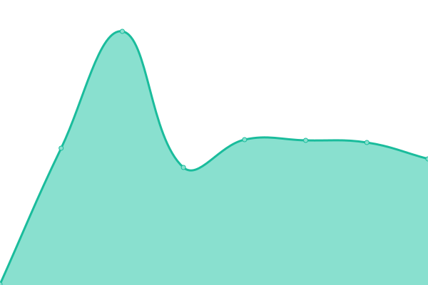

# [📈 Live Status](https://status.edgelq.com): <!--live status--> **🟧 Partial outage**

This repository contains the open-source uptime monitor and status page for [cloudwan](https://status.edgelq.com), powered by [Upptime](https://github.com/upptime/upptime).

With [Upptime](https://upptime.js.org), you can get your own unlimited and free uptime monitor and status page, powered entirely by a GitHub repository. We use [Issues](https://github.com/cloudwan/edgelq-statuspage/issues) as incident reports, [Actions](https://github.com/cloudwan/edgelq-statuspage/actions) as uptime monitors, and [Pages](https://status.edgelq.com) for the status page.

<!--start: status pages-->
<!-- This summary is generated by Upptime (https://github.com/upptime/upptime) -->
<!-- Do not edit this manually, your changes will be overwritten -->
<!-- prettier-ignore -->
| URL | Status | History | Response Time | Uptime |
| --- | ------ | ------- | ------------- | ------ |
|  [EdgeLQ API](http://healthcheck.europe-west3.unagi.dev02.nttclouds.co/edgelq_api_healthcheck) | 🟩 Up | [edge-lq-api.yml](https://github.com/cloudwan/edgelq-statuspage/commits/HEAD/history/edge-lq-api.yml) | 

 2133ms
     
 | 

<a href="https://status.edgelq.com/history/edge-lq-api">100.00%</a>
    

|  [STG Smoke Tests](https://api.github.com/repos/cloudwan/qa/actions/workflows/25360914/runs?per_page=1&page=1&status=completed) | 🟥 Down | [stg-smoke-tests.yml](https://github.com/cloudwan/edgelq-statuspage/commits/HEAD/history/stg-smoke-tests.yml) | 

 248ms
     
 | 

<a href="https://status.edgelq.com/history/stg-smoke-tests">100.00%</a>
    

<!--end: status pages-->

[**Visit our status website →**](https://status.edgelq.com)

## 📄 License

- Powered by: [Upptime](https://github.com/upptime/upptime)
- Code: [MIT](./LICENSE) © [cloudwan](https://status.edgelq.com)
- Data in the `./history` directory: [Open Database License](https://opendatacommons.org/licenses/odbl/1-0/)
